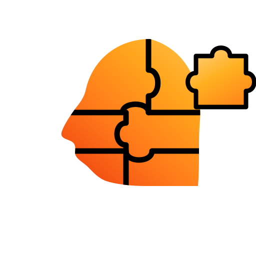

<h1 align="center">Mind Sculptor — Agente de Atendimento Multi-Nicho</h1>

<p align="center">
  
</p>

<p align="center">
  Plataforma para subir um agente de IA de atendimento por WhatsApp<br>
  em <b>qualquer nicho</b> — sem escrever código.
</p>

---

## O que é

Uma clínica de estética, um pet shop e um escritório de advocacia rodam o **mesmo código**. O que muda entre eles é configuração: base de conhecimento, catálogo, persona, etapas do funil e marca.

O dono opera tudo por um painel web instalável: assume e devolve conversas ao agente, acompanha o funil, gerencia o CRM, dispara campanhas e vê a agenda.

## Os quatro pilares

Sem qualquer um deles não existe agente:

| Pilar | Papel |
|---|---|
| **Modelo de IA** | Escolhe quais ferramentas usar e redige a resposta |
| **Prompt** | Objetivo · Ferramentas · Como agir · O que nunca fazer |
| **Ferramentas** | Código autônomo que age no mundo — agenda, CRM, cobrança |
| **Memória** | Últimas N mensagens por contato |

Sem ferramentas não é agente, é um modelo redigindo texto. Sem memória, cada mensagem reinicia a conversa. Sem base de conhecimento, o modelo inventa.

## Princípio de projeto

Todo fluxo determinístico — sincronizar planilha, enviar lembrete, cobrar assinatura, disparar campanha — é automação linear em job agendado. **O modelo de IA só é invocado onde a entrada é uma pessoa falando.** Isso corta custo e elimina margem de erro onde ela não precisa existir.

## Stack

Next.js 15 · TypeScript · Tailwind · shadcn/ui · PostgreSQL · Prisma · pg-boss
Claude Sonnet 5 (Gemini alternativo) · Whisper · Evolution API / Meta Cloud API · Asaas

## Documentação

| Documento | Conteúdo |
|---|---|
| [Design completo](docs/superpowers/specs/2026-08-27-agente-atendimento-multinicho-design.md) | Arquitetura, multi-tenancy, agente, canais, painel, cobrança, testes |
| [`docs/spec.html`](docs/spec.html) | O mesmo design renderizado e navegável |
| [`docs/brand.html`](docs/brand.html) | Guia visual da marca |
| [`assets/brand/tokens.css`](assets/brand/tokens.css) | Tokens de cor, espaço, tipografia |

Para regenerar as páginas HTML depois de editar os markdown:

```bash
python scripts/build-docs.py
```

## Roadmap

| Fase | Entrega demonstrável | Status |
|---|---|---|
| 1 · Fundação + cérebro | Conversar com o agente no navegador, sem WhatsApp | a iniciar |
| 2 · Canal | Atende de verdade num número, entendendo áudio e foto | |
| 3 · Painel núcleo | Assumir e devolver conversas | |
| 4 · CRM + funil | Ver onde cada cliente parou | |
| 5 · Simulador | Prova numérica de que ele não erra | |
| 6 · Meta + templates | Trocar de canal sem mudar mais nada | |
| 7 · Campanhas | Remarketing segmentado com throttle e opt-out | |
| 8 · Cobrança | Assinatura Asaas + link de pagamento na conversa | |
| 9 · PWA | Painel instalável com push | |

A ordem não é arbitrária: a modelagem multi-tenant é a decisão mais cara de reverter, então vem primeiro. E o simulador vem antes de dinheiro e disparo em massa — não faz sentido cobrar por um agente que ainda erra.

## Nichos de exemplo

- **clinica-estetica** — agenda, catálogo com preço por região, avaliação gratuita como objetivo
- **petshop** — banho e tosa por porte, produtos, recorrência
- **advocacia** — sem agenda e sem preço público; qualifica e encaminha a um humano

A advocacia é de propósito: é ela que prova que o sistema é genérico, e não uma clínica com nomes trocados.
